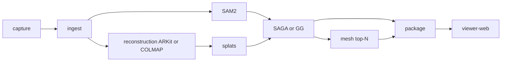

# Architecture

## North star

Phone capture → photorealistic Gaussian scene → **semantic object structure** → compact representation → WebGPU viewer → benchmarks.

The official **compression/codec layer is intentionally not implemented yet**. Existing SPZ-style splat compression was removed from the official pipeline to avoid confusing the project goal with a conventional compressed splat export. The future codec direction is a learned / neural / codebook-based spatial codec, to be designed separately.

## Capture-first ingest

```
iPhone (apps/capture-ios)
  → POST /captures/{scene_id}  (ar_package zip OR video)
  → detect capture_mode: arkit | video
  → arkit: ingest poses + skip COLMAP → transforms.json
  → video: FFmpeg + ns-process-data COLMAP
  → ns-train splatfacto → …

data/captures/{scene_id}/ar/…  OR  video.*
exports/{scene_id}/reconstruction/arkit_pose_debug.json  (ARKit path)
```

WSL is the processing server; Mac/Xcode builds the iOS app only. The **official proof** is this phone path (upload + on-device render metrics). Local video/curl paths are for debugging.

No `data/raw/*.mp4` CLI bypass.

## Pipeline (`spatial_asset_compiler.run`)



## Environments (reproducible setup)

| Env | Tools | Notes |
|-----|-------|-------|
| `spatial-asset-clean` | Nerfstudio v1.1.5, **gsplat v1.4.0**, SAM2, Open3D | torch 2.6.0+cu124; see `constraints/main-cu124.txt` |
| `saga-lift` | SegAnyGAussians | **Isolated heavy stage** — legacy torch 1.12 |
| `gaussian-grouping` | Gaussian Grouping | **Isolated heavy stage** |
| `sugar-mesh` | SuGaR | **Isolated heavy stage** — scene mesh |

Main env installs gsplat editable from `third_party/gsplat` at tag **v1.4.0** with `pip install --no-build-isolation` and `TORCH_CUDA_ARCH_LIST=7.5`.

Do not use old envs (`3dgs`, `maskgen`) or PATH entries (`stable-3d`, `colmap-cuda`).

## Asset package contract

- `manifest.json` — paths, capture metadata, `raw_splat_path` (`scene.ply`)
- `objects.json` — lifted objects with indices, bboxes, mesh paths
- `benchmarks.json` — real timings only
- `object_groups/obj_XXX.indices` — uint32 splat indices

## Viewer contract

Entry: `SpatialAssetLoader.loadPackage(manifestUrl)` — loads full package, renders `scene.ply` per manifest.

## Streaming hints (future)

`manifest.streaming_hints`: `per_object` chunks, LOD not yet implemented.
